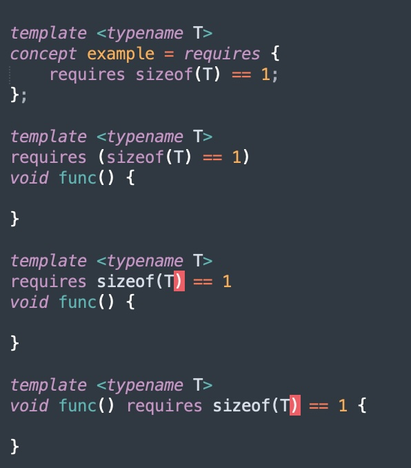

# cpp-sublime-syntax

Not perfect, but gets decent coverage for concepts & constraints.

Some screenshots from my other template heavy projects:

expected:

tuple-traits:

Captures subtle differences between the nested requirements and requires clauses. Only conjuctions (&&) and disjunctions (\|\|) are allowed without parentheses, all other expressions that involve any other operators, e.g. function calls, noexcept, need to be in parentheses.

